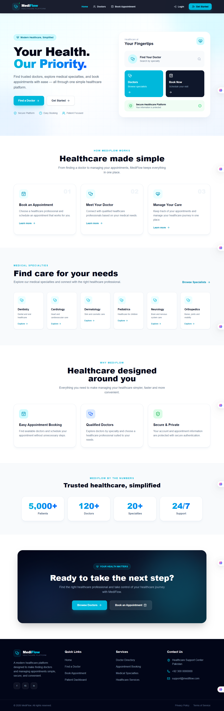
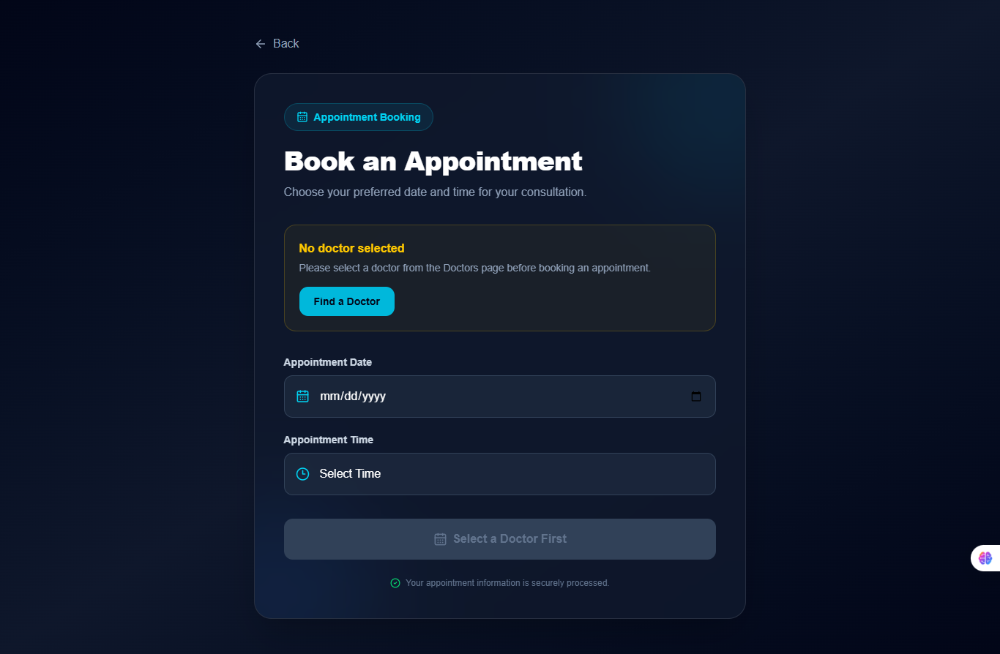
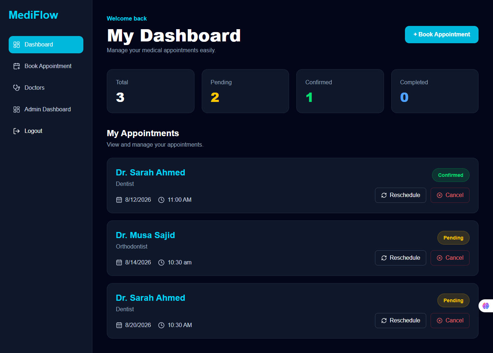
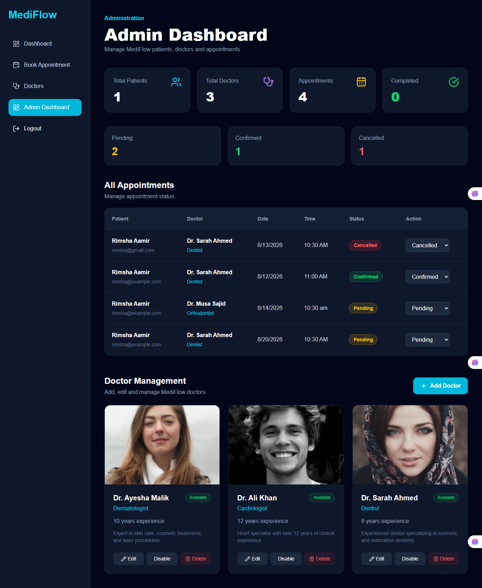
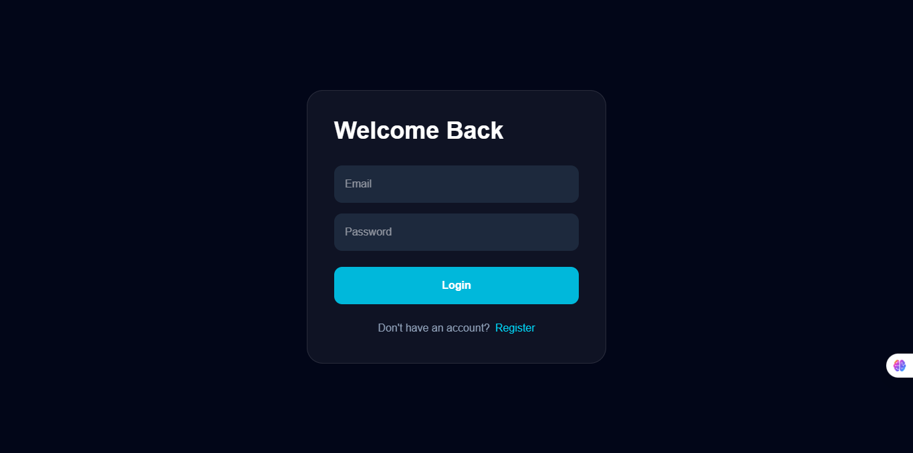
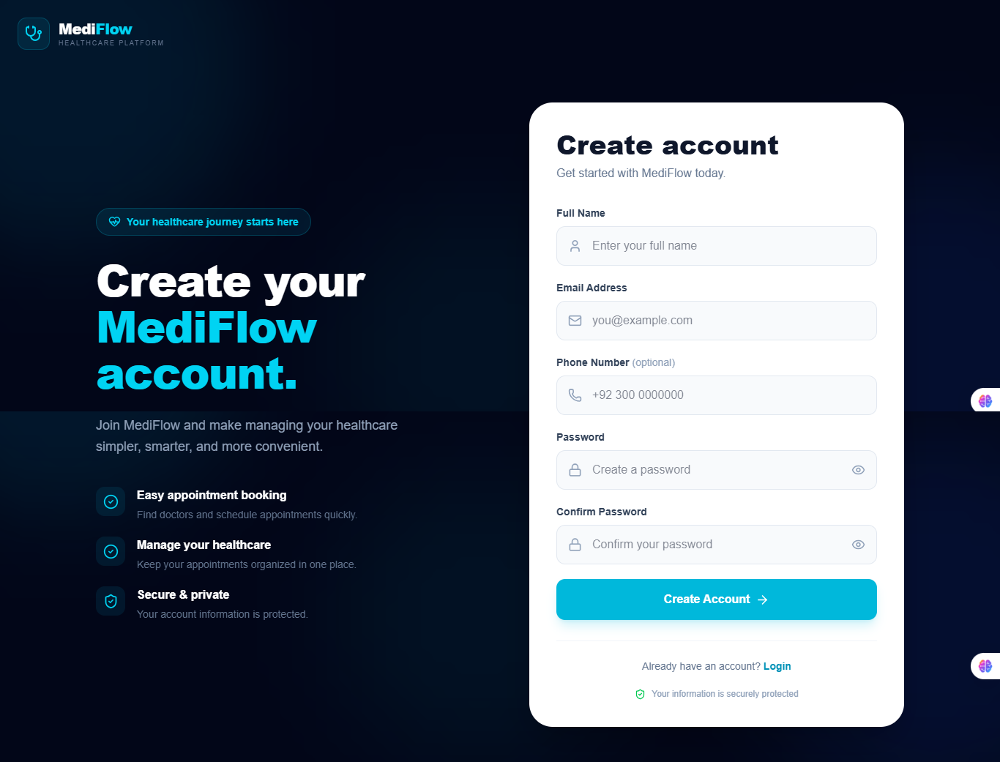

# MediFlow 🏥

### Smart Healthcare & Appointment Management System

MediFlow is a modern full-stack healthcare appointment management platform designed to simplify the process of discovering doctors, booking appointments, and managing patient healthcare information.

The system provides separate experiences for patients and administrators, with secure authentication and appointment management.

---

## ✨ Features

### 👨‍⚕️ Doctor Discovery

- Browse available doctors
- Search doctors by name
- Filter doctors by specialization
- View doctor experience and information
- Check doctor availability

### 📅 Appointment Management

- Book appointments online
- Select doctors and specializations
- View appointment information
- Track appointment status
- Cancel or update appointments

### 👤 Patient Dashboard

- Secure patient authentication
- View personal information
- View appointments
- Track appointment status

### 🛡️ Admin Dashboard

- View system statistics
- View total patients
- View total doctors
- View appointments
- Update appointment status
- Manage doctors
- Enable/disable doctor availability

### 🔐 Authentication

- User registration
- User login
- JWT authentication
- Protected routes
- Admin authorization

### 🎨 Modern UI

- Responsive design
- Modern healthcare interface
- Smooth animations
- Framer Motion animations
- Mobile navigation
- Interactive doctor cards
- Modern dashboard interface

---

## 📸 Screenshots

### 🏠 Landing Page



### 👨‍⚕️ Doctors


### 📅 Book Appointment

 (./screenshots/book-appointment1.png)

### 👤 Patient Dashboard



### 🛡️ Admin Dashboard



### 🔐 Authentication





# 🛠️ Technology Stack

## Frontend

- React
- TypeScript
- Vite
- Tailwind CSS
- React Router
- Framer Motion
- Axios
- Lucide React

## Backend

- Node.js
- Express.js
- MongoDB
- Mongoose
- JWT
- bcryptjs
- CORS
- dotenv

---

# 📁 Project Structure

```text
MediFlow/
│
├── client/
│   │
│   ├── src/
│   │   ├── components/
│   │   │   └── layout/
│   │   │       ├── Navbar.tsx
│   │   │       ├── Footer.tsx
│   │   │       └── Sidebar.tsx
│   │   │
│   │   ├── pages/
│   │   │   ├── Landing/
│   │   │   ├── Login/
│   │   │   ├── Register/
│   │   │   ├── Doctors/
│   │   │   ├── Dashboard/
│   │   │   ├── BookAppointment/
│   │   │   └── Admin/
│   │   │
│   │   ├── routes/
│   │   ├── services/
│   │   └── App.tsx
│   │
│   ├── public/
│   └── package.json
│
├── server/
│   │
│   ├── src/
│   │   ├── controllers/
│   │   ├── models/
│   │   ├── routes/
│   │   ├── middleware/
│   │   └── server.js
│   │
│   └── package.json
│
└── README.md
```
